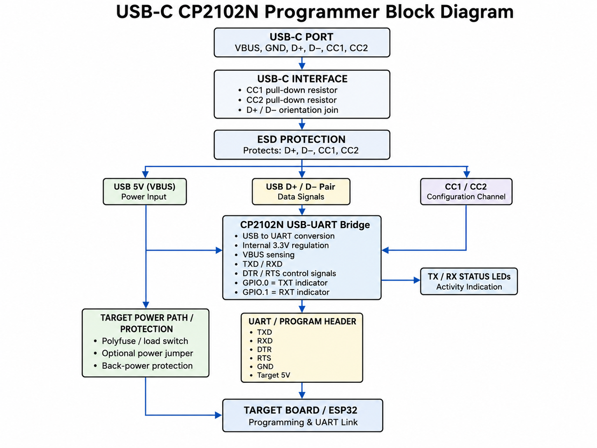
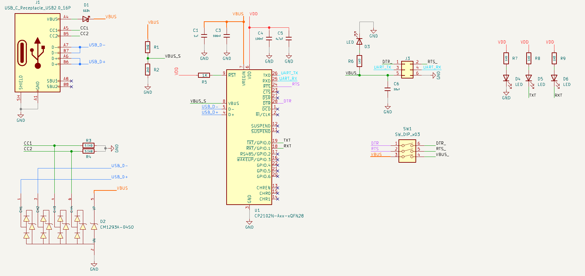
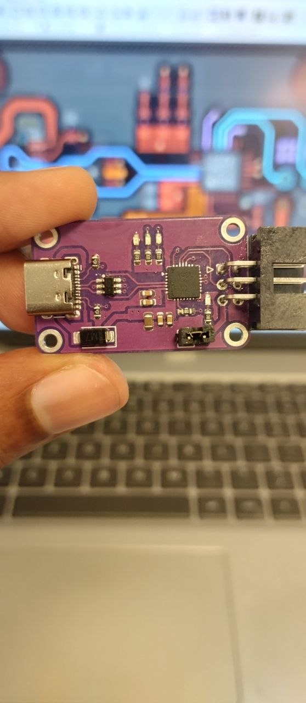
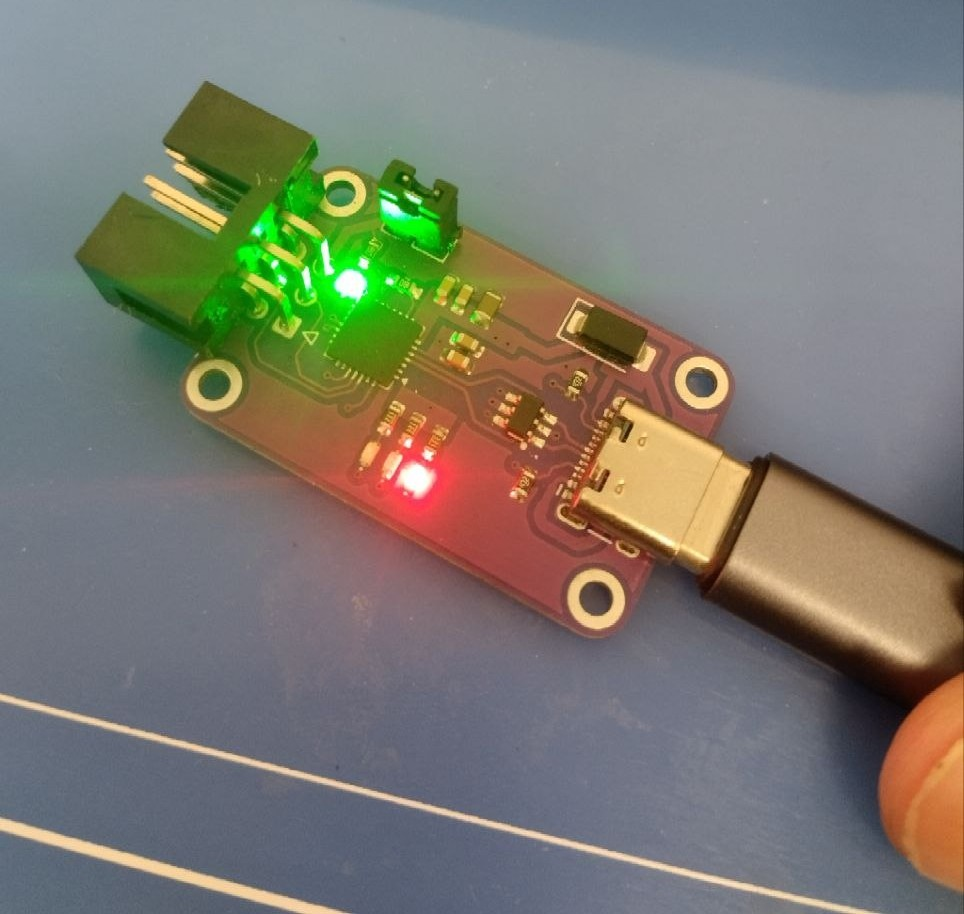

<div align="center">

# USB-C CP2102N USB-to-UART Programmer

A compact USB-C programmer and serial interface designed around the **Silicon Labs CP2102N-A02-GQFN28**.


</div>

## Overview

This project began as a simple USB-to-UART adapter and developed into a reusable programmer for ESP32 boards and other embedded targets.

The design provides:

- USB-C connectivity
- CP2102N USB-to-UART conversion
- 3.3 V UART TX and RX
- DTR and RTS programming-control signals
- TX and RX activity indicators
- 5 V access for the target board
- ESD protection on the exposed USB-C signals
- A compact 2 × 3 programming header

The main engineering work was not only placing the CP2102N on a PCB. It involved checking the USB-C contact arrangement, protecting external lines, routing the USB differential pair, managing target power, configuring the CP2102N GPIO functions and verifying the assembled board on Windows.

---

## System Architecture

<p align="center">
  
</p>

The USB-C interface provides 5 V power and USB 2.0 data. D+, D-, CC1 and CC2 pass through the ESD-protection stage before reaching the rest of the circuit. The CP2102N converts USB data into UART and provides DTR/RTS control signals for compatible target boards.

> The architecture diagram shows the intended protected target-power path. In the current prototype, the schematic uses a series Schottky diode and a selector switch in the VBUS path.

---

## Key Hardware

| Section | Implementation |
|---|---|
| USB-to-UART bridge | CP2102N-A02-GQFN28 |
| USB connector | USB 2.0 Type-C receptacle |
| USB speed | Full-Speed, 12 Mbit/s |
| ESD array | CM1293A-04SO, four channels |
| UART logic | 3.3 V |
| Programming header | TXD, RXD, DTR, RTS, VBUS, GND |
| Activity outputs | GPIO.0/TXT and GPIO.1/RXT |
| VBUS input protection | SS34 series Schottky diode |

---

## Schematic Design

<p align="center">
  <a href="schematic.pdf">
    
  </a>
</p>

<p align="center">
  <a href="schematic.pdf"><strong>Open the full schematic PDF</strong></a>
</p>

The schematic is intentionally simple, but several details are critical.

### Reversible USB-C data contacts

A USB-C receptacle exposes two USB 2.0 contact sets. Both orientations are joined on the PCB:

```text
A6 + B6  -> USB_D+
A7 + B7  -> USB_D-
```

This allows the port to operate regardless of plug orientation.

### CC pull-down resistors

The programmer is a USB-C sink/device, so CC1 and CC2 each require their own Rd resistor:

```text
CC1 -> 5.1 kΩ -> GND
CC2 -> 5.1 kΩ -> GND
```

The resistors must remain separate. A 4.7 kΩ value is a practical substitute when 5.1 kΩ is unavailable.

### ESD protection

The CM1293A-04SO protects:

- USB D+
- USB D-
- CC1
- CC2

The array is placed close to the USB-C connector so that an ESD event is diverted before travelling through the PCB.

### CP2102N support network

The core section includes:

- VREGIN and VDD decoupling
- VBUS sensing through a resistor divider
- a 1 kΩ reset pull-up
- USB D+ and D- connections
- the grounded QFN exposed pad
- UART, DTR and RTS outputs
- TXT and RXT activity outputs

### Programming-header pinout

| Pin | Signal | Function |
|---:|---|---|
| 1 | DTR | Programming control |
| 2 | RTS | Programming control |
| 3 | VBUS | Target-board 5 V access |
| 4 | UART_TX | Programmer TX -> target RX |
| 5 | UART_RX | Programmer RX <- target TX |
| 6 | GND | Common reference |

---

## PCB Design

<p align="center">
  
</p>

The PCB review focused on the areas that directly affect operation and reliability:

- USB-C connector breakout
- ESD placement and ground return
- D+/D- routing
- CP2102N decoupling and exposed-pad grounding
- short UART/control routing
- wide VBUS distribution
- connector and mounting-hole clearances

### USB differential-pair routing

<p align="center">
  
</p>

The final routed lengths were:

| Signal | Routed length |
|---|---:|
| USB D- | 24.4193 mm |
| USB D+ | 24.6993 mm |
| Difference | **0.2800 mm** |

The 0.28 mm mismatch is negligible for USB Full-Speed. No serpentine tuning was required.

Length matching helps the positive and negative halves of the differential signal arrive at nearly the same time. However, numerical matching is not the only objective. The layout also needs:

- consistent trace width
- reasonably constant spacing
- a continuous ground reference
- short duplicate-contact branches
- minimal unnecessary vias
- low loop area

Curved tracks are acceptable. The important factors are route quality, reference-plane continuity and avoiding unnecessary detours.

---

## 3D PCB Preview

<p align="center">
  
  
</p>

The 3D review was used to confirm:

- USB-C connector alignment at the board edge
- header orientation and accessibility
- LED visibility
- component-body clearances
- mounting-hole position
- front and back silkscreen readability

---

## Final Assembled Product

<p align="center">
  
  
</p>

These photos show the fabricated prototype after assembly and first power-up. They help bridge the gap between the schematic and PCB design files and the real final hardware.

What the final prototype demonstrates:

- a compact and practical USB-C form factor
- successful board assembly and connector placement
- accessible programming header and slide switch
- visible power and status LEDs on the real hardware
- successful initial power-up and USB connection

The assembled board captures the main goal of the project: building a small, reusable USB-C programmer that is both electrically sound and physically convenient to use in embedded development work.

---

## TX and RX Activity LEDs

The activity LEDs are connected to the configurable CP2102N outputs:

```text
GPIO.0 / pin 19 -> TX Toggle / TXT
GPIO.1 / pin 18 -> RX Toggle / RXT
```

The external circuit alone does not activate these outputs. They must be enabled in the CP2102N configuration memory.

Typical LED connection:

```text
3.3 V -> resistor -> LED anode
LED cathode -> TXT or RXT
```

The activity output sinks current when active.

---

## CP2102N Configuration

The configuration must target the exact device variant:

```text
CP2102N-A02-GQFN28
```

Required GPIO functions:

```text
GPIO.0 -> TX Toggle
GPIO.1 -> RX Toggle
```

Example using the Silicon Labs Standalone Manufacturing Tool:

```powershell
cp210xsmt.exe --verbose --device-count 1 `
  --set-and-verify-config CP2102N_Programmer.configuration

cp210xsmt.exe --device-count 1 `
  --reset CP2102N_Programmer.configuration
```

Avoid these options during development:

```text
--lock
--serial-nums GUID
```

`--lock` permanently prevents further customization. `--serial-nums` can overwrite the current USB serial number.

---

## Hardware Testing

Windows detected the assembled prototype as a Silicon Labs CP210x USB-to-UART bridge and assigned it a COM port.

This verified:

- USB-C attachment and power
- correct D+ and D- polarity
- successful USB enumeration
- operation of the ESD-protected data path
- CP2102N driver detection

### UART loopback test

To verify TX, RX and both activity outputs:

1. Disconnect the target board.
2. Connect programmer TXD directly to programmer RXD.
3. Open the detected COM port at 115200 baud, 8-N-1.
4. Send continuous text.
5. Confirm that the data is received back.
6. Observe both activity LEDs.

```text
TXD -------- RXD
```

Never connect TXD or RXD directly to 5 V.

---

## Project Status

| Test | Status |
|---|---|
| USB-C power and attachment | Verified |
| Windows USB enumeration | Verified |
| CP210x COM-port detection | Verified |
| D+/D- polarity and routing | Verified |
| Command-line device detection | Verified |
| UART loopback | Verified |
| TX/RX activity LEDs | Verified |

---

## Engineering Lessons

- Datasheet pin numbering must be checked from connector to IC; DRC cannot validate functional intent.
- USB-C sink devices need independent Rd resistors on CC1 and CC2.
- Both USB-C USB 2.0 contact orientations must be connected.
- ESD placement and ground-path inductance are as important as the protection-device rating.
- Differential length matching matters, but clean geometry and a continuous reference plane matter more than perfect equality.
- Configurable fixed-function ICs may need non-volatile setup before connected hardware behaves as expected.
- Safe production scripts should detect exactly one target and avoid irreversible options by default.

---


## 🙏 Thanks to PCBWay

<p align="center">
  
</p>

The complete design process — concept, schematic capture, component selection, PCB routing, assembly checks, configuration and debugging — was carried out as part of this project. Turning that design into a compact physical board, however, required accurate fabrication, especially around the USB-C connector, QFN package and fine-pitch protection components.

This design also uses **curved copper routing** in the USB section. The curves were used to create smooth transitions while maintaining the required trace width, clearance and close D+/D− length matching. The manufactured boards reproduced these routes cleanly without visible edge irregularities or solder-mask registration problems.

From visual inspection and assembly of the prototype, the PCB quality was evident in:

- clean reproduction of the curved USB data routes
- well-defined fine-pitch USB-C and QFN pads
- consistent solder-mask alignment around small SMD components
- accurate drilling and plating of the mounting holes
- clear silkscreen and readable board markings
- good board-edge and connector alignment

A sincere thank you to **PCBWay** for sponsoring the PCB fabrication and helping turn this project from a KiCad design into a real, working prototype. ❤️


## Author

**Avishka Vishwajith**  
Instrumentation and Automation Engineering  
University of Colombo, Faculty of Technology
